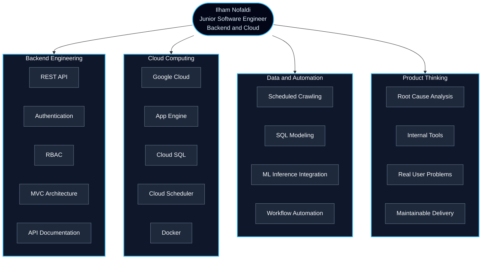
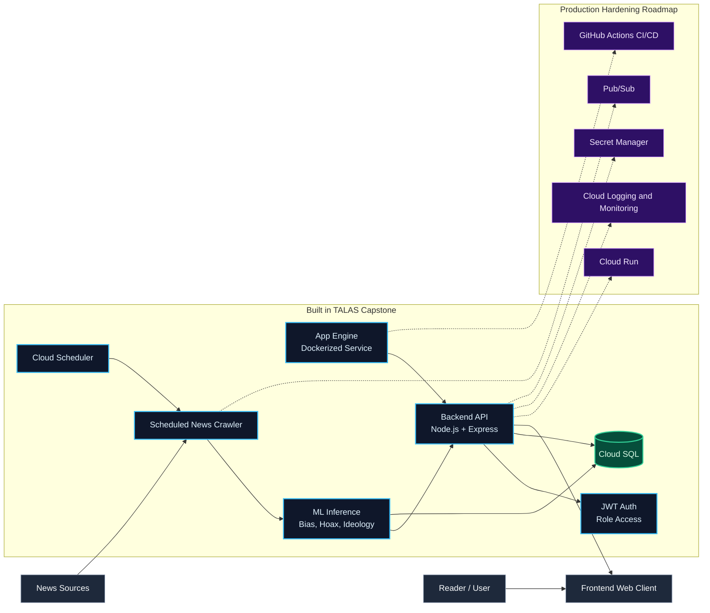
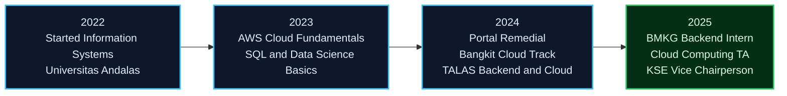
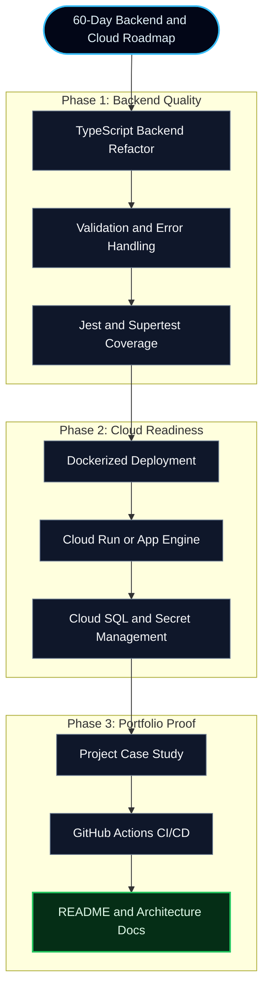

#  Hi, I'm Ilham Nofaldi

<div align="center">


<br />

<a href="https://ilhamnofaldi.voids.codes/">
  
</a>
<a href="https://www.linkedin.com/in/ilhamnofaldi">
  
</a>
<a href="mailto:ilhamnofaldi@gmail.com">
  
</a>

<br />
<br />


</div>

---

## About Me


```yaml
name: Ilham Nofaldi
role: Junior Software Engineer — Backend & Cloud
location: Jakarta x Padang, Indonesia
education: Information Systems, Universitas Andalas
focus:
  - Backend Engineering
  - Cloud Computing
  - REST API Development
  - Data Pipeline Automation
  - Process-to-System Design
open_to:
  - Backend Engineer Internship
  - Junior Backend Engineer
  - Software Engineer Backend
  - Cloud Engineer Internship
  - Small freelance backend/cloud projects
```

I build backend systems by first understanding the real process problem, then designing the **API, database model, access control, automation, and cloud deployment** around it.

My strongest proof so far is **TALAS**, a Bangkit Company Track capstone project selected as **Best Team**, where I worked as a cloud architect and backend engineer using **Node.js, Express, Docker, Google App Engine, Cloud SQL, and Cloud Scheduler**.

---

## Engineering Positioning



---

## How I Build Systems

```mermaid
flowchart LR
    A["Real Process Problem"] --> B["Requirement and Flow Analysis"]
    B --> C["Data Model Design"]
    C --> D["REST API Contract"]
    D --> E["Auth and Role Access"]
    E --> F["Cloud Deployment"]
    F --> G["Automation and Observability"]
    G --> H["Usable Product"]

    classDef sourceNode fill:#0f172a,stroke:#38bdf8,color:#e0f2fe,stroke-width:2px;
    classDef processNode fill:#111827,stroke:#64748b,color:#f8fafc,stroke-width:1px;
    classDef outcomeNode fill:#052e16,stroke:#22c55e,color:#dcfce7,stroke-width:2px;

    class A sourceNode;
    class B,C,D,E,F,G processNode;
    class H outcomeNode;
```



> A system is not “done” when the feature works once. It is done when the flow can be used, traced, maintained, and improved.

---

## Tech Stack

<div align="center">

### Backend and API


### Languages


### Cloud and DevOps


### Database and Frontend


</div>

---

## Featured Work

### TALAS — News Bias Analysis Platform

<div align="center">

<a href="https://github.com/GitAJov/TALAS">
  
</a>

</div>

**Tech:** Node.js, Express, Google Cloud, App Engine, Cloud SQL, Cloud Scheduler, Docker, Machine Learning Integration  
**Role:** Backend Engineer and Cloud Architect  
**Recognition:** Best Team — Bangkit Company Track Capstone

TALAS collects news on a schedule, sends it through ML-based scoring for bias, hoax, and ideology detection, then presents the result with two-sided summaries.



**What I contributed:**

- Designed the Google Cloud architecture with App Engine, Cloud SQL, Docker, and Cloud Scheduler.
- Built 12+ REST API endpoints that orchestrate ML inference outputs.
- Implemented JWT-based authentication and backend flow for the capstone system.
- Automated scheduled news crawling so the dataset could refresh without manual intervention.
- Helped the team connect product logic, backend responses, and ML-based news analysis.

---

### Other Projects

<table>
  <tr>
    <td width="33%" valign="top">
      <h3>Portal Remedial FTI Unand</h3>
      <p><strong>Tech:</strong> Node.js, Express, EJS, Sequelize, MySQL</p>
      <p>Solo full-stack project with MVC architecture, migrations, models, seeders, authentication, and role-based access.</p>
      <p><strong>Highlight:</strong> built independently with 80+ commits.</p>
    </td>
    <td width="33%" valign="top">
      <h3>SIPENCUTI PPSDM MKG</h3>
      <p><strong>Tech:</strong> Node.js, Express, EJS, MySQL</p>
      <p>Backend prototype for a three-role leave-request system at BMKG PPSDM STMKG.</p>
      <p><strong>Core idea:</strong> leave quota should be derived from request history, not tracked manually.</p>
    </td>
    <td width="33%" valign="top">
      <h3>KSE Alumni Database</h3>
      <p><strong>Tech:</strong> React, Express, MySQL</p>
      <p>Internal alumni data application used by the Karya Salemba Empat scholarship community.</p>
      <p><strong>Context:</strong> built to support real organizational data management.</p>
    </td>
  </tr>
  <tr>
    <td width="33%" valign="top">
      <h3>FarmHub Analytics</h3>
      <p><strong>Tech:</strong> React, TypeScript, UI/UX</p>
      <p>Frontend contribution for a workspace concept combining feasibility, finance, and harvest planning.</p>
      <p><strong>Role:</strong> frontend and interface implementation.</p>
    </td>
    <td width="33%" valign="top">
      <h3>Dashboard IoT Billing</h3>
      <p><strong>Tech:</strong> React, TypeScript, Tailwind CSS</p>
      <p>Frontend admin console for an IoT billing dashboard.</p>
      <p><strong>Scope:</strong> frontend interface; backend and BLE integration handled by teammates.</p>
    </td>
    <td width="33%" valign="top">
      <h3>Portfolio Website</h3>
      <p><strong>Tech:</strong> React, TypeScript, Framer Motion</p>
      <p>Personal portfolio focused on honest technical branding, project storytelling, and recruiter-friendly presentation.</p>
      <p><a href="https://ilhamnofaldi.voids.codes/">Visit portfolio</a></p>
    </td>
  </tr>
</table>

---

## Project Ecosystem

```mermaid
flowchart TB
    CENTER["Backend and Cloud Portfolio"]

    CENTER --> TALAS["TALAS<br/>News Analysis Platform"]
    CENTER --> REMEDIAL["Portal Remedial<br/>Academic Internal Tool"]
    CENTER --> CUTIL["SIPENCUTI<br/>Leave Request Backend"]
    CENTER --> KSE["KSE Alumni Database<br/>Organization Data System"]
    CENTER --> FARM["FarmHub Analytics<br/>Frontend Workspace"]
    CENTER --> IOT["IoT Billing Dashboard<br/>Admin Console"]

    TALAS --> T1["GCP Architecture"]
    TALAS --> T2["Scheduled Crawling"]
    TALAS --> T3["ML Output Orchestration"]

    REMEDIAL --> R1["MVC Structure"]
    REMEDIAL --> R2["Auth and RBAC"]
    REMEDIAL --> R3["Sequelize Migration"]

    CUTIL --> C1["Three Role Workflow"]
    CUTIL --> C2["Quota Logic"]
    CUTIL --> C3["Backend Flow Analysis"]

    KSE --> K1["Internal Data Management"]
    KSE --> K2["React + Express + MySQL"]

    FARM --> F1["React + TypeScript UI"]
    IOT --> I1["Admin Dashboard UI"]

    classDef center fill:#020617,stroke:#38bdf8,color:#e0f2fe,stroke-width:3px;
    classDef project fill:#0f172a,stroke:#22c55e,color:#f0fdf4,stroke-width:2px;
    classDef detail fill:#1e293b,stroke:#64748b,color:#f8fafc,stroke-width:1px;

    class CENTER center;
    class TALAS,REMEDIAL,CUTIL,KSE,FARM,IOT project;
    class T1,T2,T3,R1,R2,R3,C1,C2,C3,K1,K2,F1,I1 detail;
```



---

## Experience Highlights



### Cloud Computing Teaching Assistant

Supported 90+ students in Cloud Computing labs, covering deployment, cloud databases, and service orchestration. Helped students debug technical issues and turn cloud concepts into reproducible examples.

### Bangkit Academy — Cloud Computing Cohort

Built TALAS as cloud architect and backend engineer, combining REST APIs, Google Cloud deployment, Docker, scheduled data ingestion, and ML inference integration.

### Backend Project Intern — BMKG PPSDM STMKG

Worked on the backend of a three-role leave-request application and modeled leave quota logic from recorded request history instead of relying on manual tracking.

### Vice Chairperson — KSE Universitas Andalas

Help lead a 67-member scholarship community, focusing on internal operations, board coordination, program execution, Quality Evaluation, and workflow automation.

---

## Current Growth Plan



---

## GitHub Analytics

<div align="center">


</div>

---

## Contribution Streak

<div align="center">


</div>

---

## Activity Graph

<div align="center">


</div>

---

## Contribution Snake

<div align="center">

<picture>
  <source media="(prefers-color-scheme: dark)" srcset="https://raw.githubusercontent.com/Ilhamnofaldi/Ilhamnofaldi/output/github-contribution-grid-snake-dark.svg">
  <source media="(prefers-color-scheme: light)" srcset="https://raw.githubusercontent.com/Ilhamnofaldi/Ilhamnofaldi/output/github-contribution-grid-snake.svg">
  
</picture>

</div>

---

## GitHub Trophies

<div align="center">


</div>

---

## Credentials

| Credential | Issuer | Year | Link |
|---|---|---:|---|
| Best Team — Bangkit Company Track Capstone | Bangkit Academy | 2025 | Portfolio certificate |
| Belajar Dasar AWS Cloud | Dicoding Indonesia | 2023 | [Verify](https://www.dicoding.com/certificates/NVP7805Y4XR0) |
| Dasar Structured Query Language | Dicoding Indonesia | 2023 | [Verify](https://www.dicoding.com/certificates/N9ZO5W2E6PG5) |
| Pengenalan Database Menggunakan MySQL | CODEPOLITAN | 2023 | [Verify](https://codepolitan.com/c/4ORUF1Z) |
| Belajar Dasar Data Science | Dicoding Indonesia | 2023 | [Verify](https://www.dicoding.com/certificates/L4PQQ6O52PO1) |
| Belajar Dasar Pemrograman Web | Dicoding Indonesia | 2024 | [Verify](https://www.dicoding.com/certificates/KEXL8YDM0ZG2) |
| Network Addressing and Basic Troubleshooting | Cisco | 2023 | [Verify](https://www.credly.com/badges/d4fe6d00-0f11-4551-a9ac-b46e0e50fbf9) |

---

## What I Am Looking For

I am open to opportunities in:

- Backend Engineer Internship
- Junior Backend Engineer
- Software Engineer Backend
- Cloud Engineer Internship
- Platform Engineer Internship
- Backend Engineer for AI or data products

I am especially interested in roles where I can work on **APIs, database-backed systems, cloud deployment, automation, and product features that solve real operational problems**.

---

## Connect With Me

<div align="center">

<a href="https://www.linkedin.com/in/ilhamnofaldi">
  
</a>
<a href="mailto:ilhamnofaldi@gmail.com">
  
</a>
<a href="https://github.com/Ilhamnofaldi">
  
</a>
<a href="https://ilhamnofaldi.voids.codes/">
  
</a>

</div>

---

<div align="center">


### Let's build backend systems that solve real process problems.

</div>
