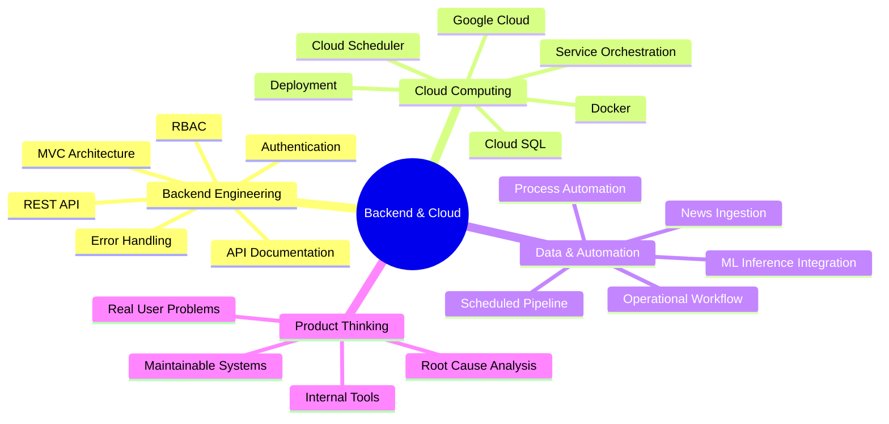
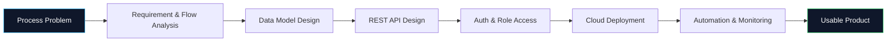
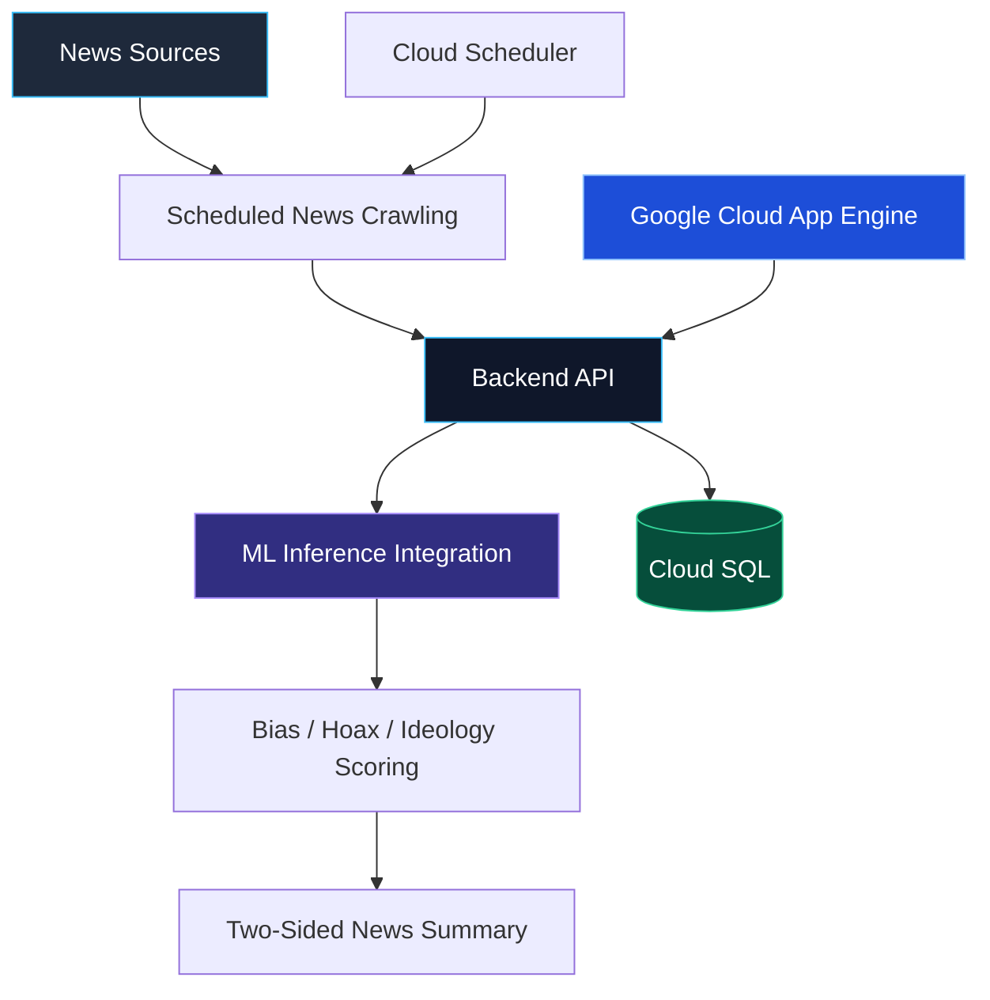
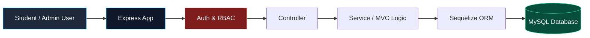
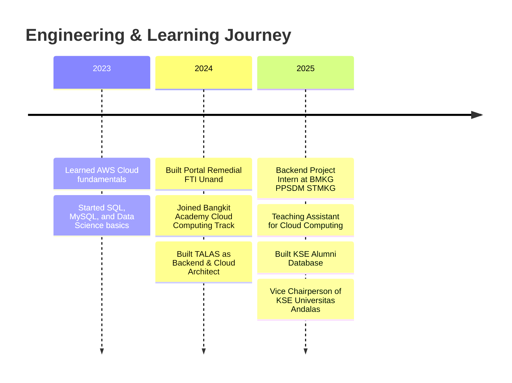
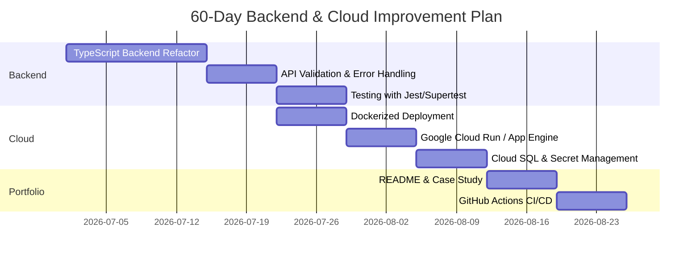

#  Hi, I'm Ilham Nofaldi

<div align="center">


<br/>


</div>

---

## About Me


```yaml
name: Ilham Nofaldi
role: Backend & Cloud Engineer
location: Indonesia
education: Information Systems, Universitas Andalas
focus:
  - Backend Engineering
  - Cloud Computing
  - REST API Development
  - Data Pipeline Automation
  - Process-to-System Design
current_goal: Backend / Software Engineer Internship or Entry-Level Role
```

I'm a final-year Information Systems student focused on building **backend systems, cloud-deployed applications, and scheduled data pipelines**.

My strongest area is translating real operational problems into technical systems: designing APIs, modeling databases, implementing access control, automating workflows, and deploying services to the cloud.

- Backend & API: **Node.js, Express, REST API, JWT, RBAC, MVC**
- Cloud & Deployment: **Google Cloud, Docker, Cloud SQL, Cloud Scheduler**
- Database: **MySQL, PostgreSQL, Sequelize, data modeling**
- Product direction: **AI/data products, internal tools, automation, and cloud-backed systems**
- Highlight: Built **TALAS**, a news-bias analysis platform selected as **Best Team – Bangkit Company Track Capstone**

---

## My Engineering Sweet Spot



---

## How I Think When Building Systems



> I prefer to understand the process problem first, then design the API, database, automation, and cloud deployment around it.

---

## Tech Stack

<div align="center">

### Backend & API


### Languages


### Cloud & DevOps


### Database & Frontend


</div>

---

## Featured Projects

### TALAS — News Bias Analysis Platform



**Tech:** Node.js, Express, Google Cloud, Docker, Cloud SQL, Cloud Scheduler, Machine Learning Integration

TALAS is a news-bias analysis platform that collects news on a schedule, sends it through ML-based scoring for bias, hoax, and ideology detection, then presents the result with two-sided summaries.

**My contribution:**

- Designed Google Cloud architecture using App Engine, Cloud SQL, Docker, and Cloud Scheduler
- Built 12+ REST API endpoints
- Integrated backend responses with ML inference output
- Automated scheduled news ingestion without manual intervention
- Contributed as cloud architect and backend engineer
- Team selected as **Best Team – Bangkit Company Track Capstone**

Repository: `https://github.com/Ilhamnofaldi/REPLACE_WITH_TALAS_REPO_NAME`

---

### Portal Remedial FTI Unand



**Tech:** Node.js, Express, EJS, Sequelize, MySQL

A full-stack remedial portal built independently with a complete MVC structure, database migrations, models, seeders, authentication, and role-based access control.

**Highlights:**

- Built solo with 80+ commits
- Implemented authentication and role-based access
- Designed relational database structure using Sequelize and MySQL
- Organized the backend using MVC architecture

Repository: `https://github.com/Ilhamnofaldi/REPLACE_WITH_PORTAL_REMEDIAL_REPO_NAME`

---

### KSE Alumni Database

**Tech:** React, Express, MySQL

An internal alumni records application for the Karya Salemba Empat scholarship community.

**Highlights:**

- Built for real internal organizational use
- Supports structured alumni data management
- Combines frontend interface, backend API, and relational database

Repository: `https://github.com/Ilhamnofaldi/REPLACE_WITH_KSE_ALUMNI_REPO_NAME`

---

## Project Cards

> Replace the repository names below with your real repository names before publishing.

<div align="center">

<a href="https://github.com/Ilhamnofaldi/REPLACE_WITH_TALAS_REPO_NAME">
  
</a>

<a href="https://github.com/Ilhamnofaldi/REPLACE_WITH_PORTAL_REMEDIAL_REPO_NAME">
  
</a>

</div>

<br/>

<div align="center">

<a href="https://github.com/Ilhamnofaldi/REPLACE_WITH_KSE_ALUMNI_REPO_NAME">
  
</a>

</div>

---

## Experience Highlights



### Cloud Computing Teaching Assistant

Supported 90+ students in Cloud Computing labs, covering deployment, cloud databases, and service orchestration. Helped students debug technical issues and turn cloud concepts into reproducible examples.

### Bangkit Academy — Cloud Computing Cohort

Built TALAS as cloud architect and backend engineer, combining REST APIs, Google Cloud deployment, Docker, scheduled data ingestion, and ML inference integration.

### Backend Project Intern — BMKG PPSDM STMKG

Worked on the backend of a three-role leave-request application and modeled leave quota logic from recorded request history instead of relying on manual tracking.

---

## Current 60-Day Growth Plan



---

## GitHub Analytics

<div align="center">

### GitHub Overview


</div>

---

## Contribution Streak

<div align="center">


</div>

---

## Activity Graph

<div align="center">


</div>

---

## Contribution Snake

<div align="center">

<picture>
  <source media="(prefers-color-scheme: dark)" srcset="https://raw.githubusercontent.com/Ilhamnofaldi/Ilhamnofaldi/output/github-contribution-grid-snake-dark.svg">
  <source media="(prefers-color-scheme: light)" srcset="https://raw.githubusercontent.com/Ilhamnofaldi/Ilhamnofaldi/output/github-contribution-grid-snake.svg">
  
</picture>

</div>

> Note: The snake animation requires a separate GitHub Actions workflow to generate the SVG into the `output` branch.

---

## GitHub Trophies

<div align="center">


</div>

---

## What I'm Looking For

I'm open to internship or entry-level opportunities in:

- Backend Engineer
- Software Engineer Backend
- Cloud Engineer Intern
- Platform Engineer Intern
- Backend Engineer for AI/Data Products

I am especially interested in roles where I can work on **APIs, database-backed systems, cloud deployment, automation, and product features that solve real operational problems**.

---

## Connect with Me

<div align="center">

<a href="https://www.linkedin.com/in/ilhamnofaldi/">
  
</a>

<a href="mailto:ilhamnofaldi@gmail.com">
  
</a>

<a href="https://github.com/Ilhamnofaldi">
  
</a>

<a href="https://ilhamnofaldi.voids.codes">
  
</a>

</div>

---

<div align="center">


### Let's build backend systems that solve real process problems.

</div>
