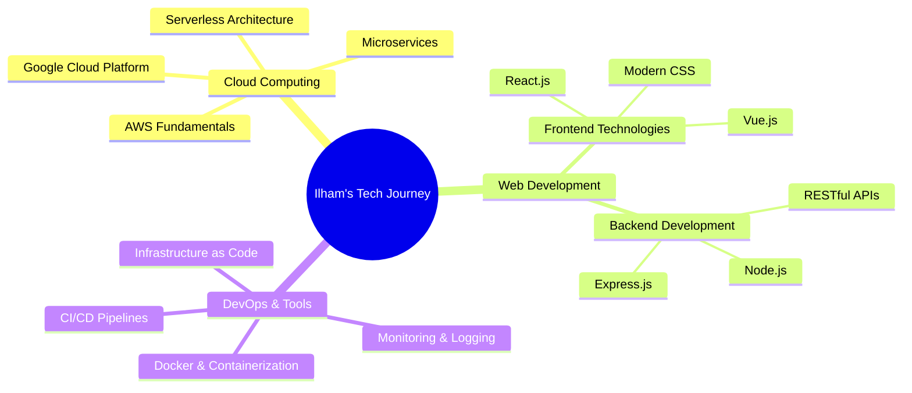

#  Hi there, I'm Ilham Nofaldi!

<div align="center">
  
</div>

<div align="center">
  
  
</div>

---

## 🚀 About Me


```yaml
name: Ilham Nofaldi
pronouns: He/Him
location: Indonesia
current_focus: Cloud Computing & Web Development
learning: Bangkit Program - Cloud Computing Track
fun_fact: I can lift my own body weight, but still learning to scale databases 🏋️‍♂️
```

- 🔭 I'm currently working on **Cloud-native applications**
- 🌱 I'm currently learning **Cloud Computing fundamentals** through Bangkit
- 👯 I'm looking to collaborate on **Open-source cloud projects**
- 💬 Ask me about **Cloud Computing, Web Development, DevOps**
- 📫 How to reach me: **ilhamnofaldi@gmail.com**
- ⚡ Fun fact: **I once ran a marathon by accident! 🏃‍♂️**

---

## 🛠️ Tech Stack & Tools

<div align="center">

### 💻 Programming Languages
<p>
  
  
  
  
  
</p>

### ☁️ Cloud & DevOps
<p>
  
  
  
  
  
</p>

### 🗄️ Databases & Tools
<p>
  
  
  
  
</p>

</div>

---

## 📊 GitHub Analytics

<div align="center">
📈 GitHub Overview
<div align="center">
  
  
</div>
🔥 Contribution Streak
<div align="center">
  
</div>
</div>

---

## 🐍 Contribution Snake

<div align="center">
  <picture>
    <source media="(prefers-color-scheme: dark)" srcset="https://raw.githubusercontent.com/platane/platane/output/github-contribution-grid-snake-dark.svg">
    <source media="(prefers-color-scheme: light)" srcset="https://raw.githubusercontent.com/platane/platane/output/github-contribution-grid-snake.svg">
    
  </picture>
</div>

---

## 🏆 GitHub Trophies

<div align="center">
  
</div>

---

## 📈 Activity Graph

<div align="center">
  
</div>

---

## 🎯 Current Focus Areas

<div align="center">



</div>

---

## 💼 Featured Projects

<div align="center">

<a href="https://github.com/ilhamnofaldi/cloud-project-1">
  
</a>

<a href="https://github.com/ilhamnofaldi/web-app-project">
  
</a>

</div>

---

## 🤝 Connect with Me

<div align="center">
  <a href="https://twitter.com/ilhamnofaldi">
    
  </a>
  <a href="https://www.linkedin.com/in/ilhamnofaldi/">
    
  </a>
  <a href="mailto:ilhamnofaldi@gmail.com">
    
  </a>
  <a href="https://www.instagram.com/ilhamnofaldi/">
    
  </a>
</div>

---

## 📅 Coding Calendar

<div align="center">
  
</div>

> **Alternative 3D Calendar:** For a 3D contribution calendar, you can use [GitHub Skyline](https://skyline.github.com/) or set up a custom 3D visualization.

---

## 💭 Dev Quote

<div align="center">
  
</div>

---

## 🎵 Spotify Now Playing

<div align="center">
  
</div>

> **Setup Required:** To display your currently playing Spotify track, you'll need to connect your Spotify account. Instructions below.

---

<div align="center">
  
</div>

<div align="center">
  <h3>⭐ Thanks for visiting! Let's build something amazing together! ⭐</h3>
  <p>
     
    <em>Happy Coding!</em> 
    
  </p>
</div>

---
